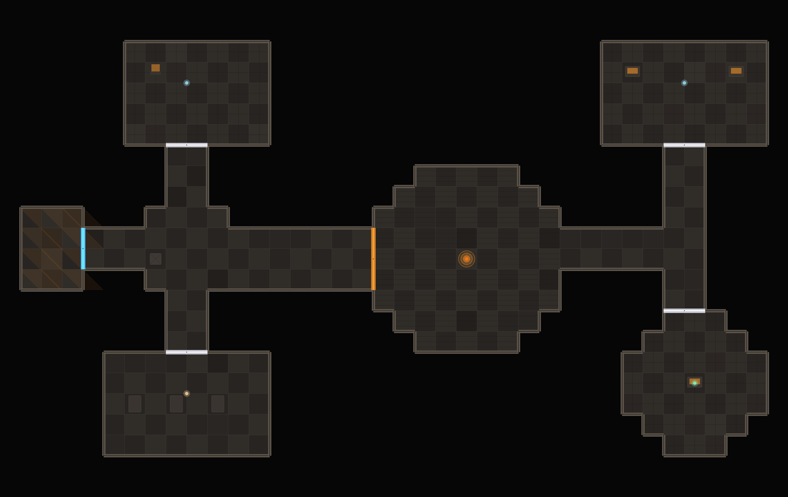

# SectorForge

**SectorForge is an AI-powered dungeon and map generation engine designed for
science-fiction tabletop campaigns.** It ships as a Claude Code plugin: you
describe a location, Claude designs the deck layout, and a deterministic engine
renders a top-down battlemap while **auto-deriving walls, doors, and dynamic
lighting** — exporting files that drop straight into **Foundry VTT (v13/v14)** and
any **Universal VTT**-compatible tabletop (Roll20, Fantasy Grounds, Arkenforge…).



> LLM for creativity, code for VTT-data correctness: Claude never hand-places
> walls — they're derived from the floor boundary, so line-of-sight and lighting
> just work on import.

## What you get per map

| File | What it is |
|------|------------|
| `<name>.png` | Top-down procedural sci-fi battlemap (evenly lit, grid-aligned). |
| `<name>.dd2vtt` | **Universal VTT** — image + walls + doors + lights. The portable, cross-VTT format. |
| `<name>.fvtt.json` | **Native Foundry scene** (v13/v14 data model). |
| `<name>.prompt.txt` | z-image/ComfyUI art prompt for the optional hybrid path. |

## Install

SectorForge is a Claude Code plugin. It does **not** need a server — this git
repo is all the "hosting" required. The repo is both a plugin (at the root) and a
one-plugin marketplace (`.claude-plugin/marketplace.json`).

**Requirements:** **Python 3.9+** and **Pillow** (`pip install Pillow`).

**Install from GitHub** (in Claude Code):
```
/plugin marketplace add dakesec/SectorForge
/plugin install sector-forge@sectorforge
```

**Install from a local clone** (no GitHub needed) — point the marketplace at the
folder instead:
```
/plugin marketplace add /absolute/path/to/SectorForge
/plugin install sector-forge@sectorforge
```

After installing, restart Claude Code if prompted. Then use `/dungeon …` or just
ask for a sci-fi battlemap.

**Using it in regular Claude Desktop / Claude.ai chat threads** (not Claude Code):
those threads can't load Claude Code plugins, but they can load an uploaded
**Agent Skill**. Grab [`dist/sector-forge.skill`](dist/) and upload it via
**Settings → Capabilities → Skills**. See [`dist/README.md`](dist/README.md).

**Verify the engine** (optional, standalone):
```bash
python scripts/build_map.py examples/derelict-station.json --out out
```
You should get a PNG, a `.dd2vtt`, a `.fvtt.json`, and a prompt in `out/`.

## Use

In Claude Code:

```
/dungeon derelict mining station — reactor core, 3 crew quarters, med-bay, bridge; emergency lighting, derelict_industrial theme
```

Or just ask in natural language ("make me a Foundry battlemap of a research
station overrun by something…") — the **sector-forge** skill activates
automatically.

Claude writes a **map-spec JSON**, runs the engine, shows you the map, and hands
you the VTT files. Iterate by asking for changes — the engine is deterministic,
so the same spec always yields the same map.

## How it works

```
narrative direction
      │  (Claude designs)
      ▼
 map-spec JSON  ──►  geometry.py  ──►  walls + doors + line-of-sight
      │                                (auto-derived from floor boundary)
      │  build_map.py
      ▼
  render.py  ──►  PNG          exporters ──►  .dd2vtt  +  .fvtt.json (v13/v14)
```

The hybrid path swaps the procedural PNG for AI art:

```
<name>.prompt.txt ─► ComfyUI z-image ─► art.png ─► repack_image.py
                                                   └► .dd2vtt + .fvtt.json (art bg, same walls)
```

## Foundry v13/v14 notes

The Foundry exporter targets the **v13/v14** Scene data model:
- Walls carry the v12+ `threshold` object; sense/movement use the stable
  `0`/`20` enums; doors use `door`/`ds`.
- Lights emit the fuller v13/v14 `AmbientLight` `config` (negative, priority,
  coloration, attenuation, animation, darkness range…).
- The removed top-level `globalLight` / `darkness` / `fogExploration` fields are
  replaced by the `environment` and `fog` objects. The map-spec `darkness` (0–1)
  drives `environment.darknessLevel`.

Foundry cleans unknown fields and fills defaults on import, so minor version
drift is tolerated. The `.dd2vtt` path is the most version-stable if you hit a
schema mismatch.

## Layout

```
SectorForge/
├── .claude-plugin/plugin.json
├── commands/dungeon.md                 # /dungeon slash command
├── skills/sector-forge/
│   ├── SKILL.md                        # how Claude turns direction → spec → files
│   └── references/
│       ├── map-spec-schema.md          # full spec field reference
│       ├── themes.md                   # themes, floors, props, lighting
│       └── vtt-formats.md              # export formats + import steps
├── scripts/
│   ├── build_map.py                    # spec → PNG + UVTT + Foundry + prompt
│   ├── geometry.py                     # occupancy + wall/door derivation
│   ├── render.py                       # procedural tile rendering (Pillow)
│   └── repack_image.py                 # hybrid: swap in AI art, keep VTT data
└── examples/
    └── derelict-station.json           # worked example
```

## Notes & limitations
- Rooms can be **rect, circle/ellipse, diamond, octagon, or polygon** — overlap
  shapes to compose complex spaces. Round rooms are grid-aligned (stair-stepped),
  matching how VTT walls and line-of-sight work.
- Doors use the **connection form** `{from, to}` and snap to the actual opening
  between rooms, so they always line up with the passage. `autoDoors` seals every
  room↔corridor opening at once.
- Props are decorative (non-collidable). Model sight-blockers as tiny rooms.
- Foundry's scene schema shifts across major versions; the `.dd2vtt` path is the
  most version-stable. The Foundry JSON targets v13/v14.
- Single deck per spec. For multi-level stations, make one spec per deck and note
  the stair/lift connections.

## License

[GPL-3.0](LICENSE).
